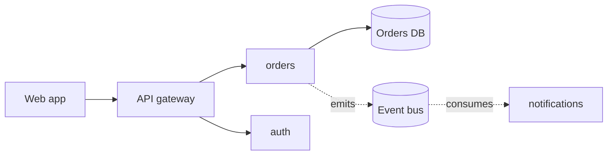
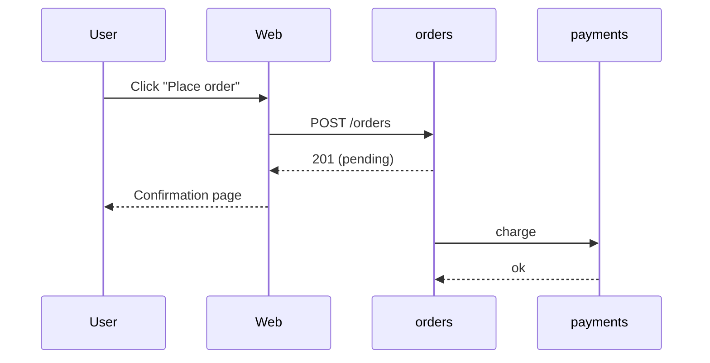
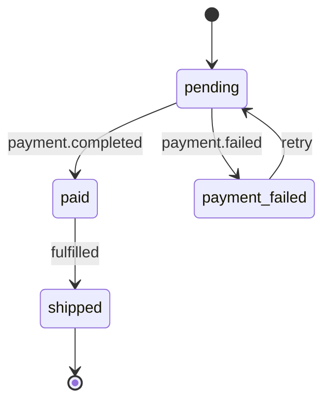
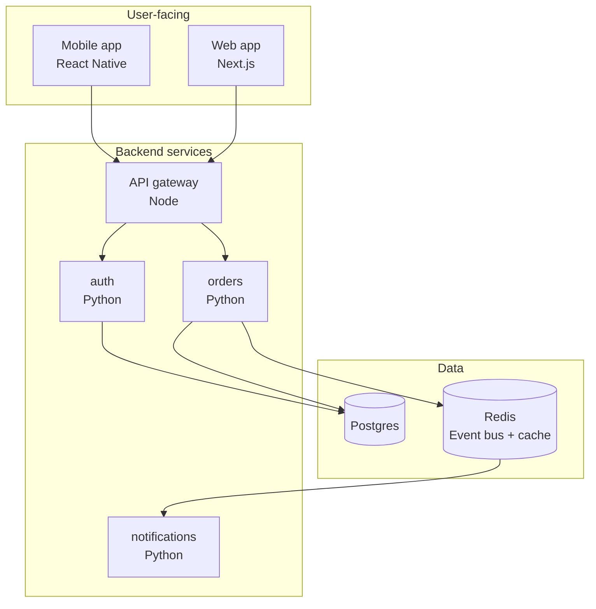

# Diagrams

A diagram exists to show something prose cannot show, or cannot show as efficiently. A diagram that exists "because diagrams look good" is noise. The reader scans it, sees no new information, and learns to ignore your diagrams.

## Decision: do I need a diagram here?

Ask:

1. **Is there a spatial or topological relationship?** Multiple services calling each other; module hierarchy; data flow through stages. Yes → diagram likely helps.
2. **Is there a temporal sequence with 3+ participants?** A flow involving more than two services in a specific order. Yes → sequence diagram.
3. **Are there discrete states with transitions?** An entity moves through statuses. Yes → state diagram.
4. **Is the structure obvious from prose?** Two services, A calls B. No diagram needed — one sentence is faster.
5. **Would the diagram have more than 15 nodes?** Yes → either split the diagram or use a hierarchy (C4-style zoom).

If none of (1)(2)(3) apply, do not add a diagram. Prose is fine.

## Diagram types and when to use each

### Flowchart / graph (Mermaid `graph`)

Use for **structural relationships**: who depends on who, who calls who, how data moves through stages.

**Tips:**
- Use `LR` (left-right) for call flows; `TB` (top-bottom) for hierarchies.
- Use solid arrows (`-->`) for synchronous calls; dashed (`-.->` with a label) for events.
- Use `[(database name)]` shape for databases, `[name]` for services, `((name))` for users.
- Keep node names short. Long labels destroy the visual scan.

### Sequence diagram (Mermaid `sequenceDiagram`)

Use for **temporal flows** with 3+ participants. The single best diagram type for "what happens when..." narratives.

**Tips:**
- One-letter or short aliases (`U`, `W`, `O`) keep arrows readable.
- Use `->>` for sync calls, `-->>` for responses, `-)` for async/fire-and-forget.
- Add `Note over X,Y: ...` for callouts about what happens between steps.
- Do not draw every step the system takes. Draw the steps the reader needs to know.

### State diagram (Mermaid `stateDiagram-v2`)

Use when an entity has explicit states. Orders, payments, jobs, deployments, user lifecycle.

### C4 Context / Container / Component

For overall architecture, the C4 model gives you a vocabulary that scales:

- **Context (Level 1)**: The system as a black box, with users and external systems around it. Use in the **overview**.
- **Container (Level 2)**: The deployable units (services, databases, queues) and the major links between them. Use in the **architecture page** or **overview** for medium-complex systems.
- **Component (Level 3)**: The internal structure of one container. Use in a **service page** if the service has internal complexity worth diagramming.
- **Code (Level 4)**: Rarely worth drawing manually — the IDE shows you this. Skip unless the structure is unusual.

For repomap, Container is the workhorse. Express it in Mermaid:

The `subgraph` blocks act as the "containers" grouping. The reader can scan and see "user-facing | backend | data" at a glance.

## Captions: the rule that doubles diagram value

**Every diagram is followed by a caption that tells the reader what to see in it.**

A caption is not a title. A title says what the diagram is *of*. A caption says what to *notice*.

| Bad caption                | Good caption                                                                 |
|----------------------------|------------------------------------------------------------------------------|
| "The order flow"           | "Notice that the user gets a response from the web app before payment runs." |
| "Service dependencies"     | "Every service calls `auth`. If `auth` is down, the whole system is read-only." |
| "Database schema"          | "The `orders` and `payments` tables both reference `users` but never each other directly." |

The caption is where the diagram earns its place. Without it, the diagram is decoration.

## Things to avoid in diagrams

- **Diagram inflation**: showing every line of communication including health checks, logging, metrics. The reader does not need to see these — they are infrastructure, not architecture. Show only the *business-meaningful* edges.
- **Two diagrams that show the same thing**: if you have a flowchart and a sequence diagram of the same flow, cut one.
- **Diagrams that contradict the prose**: if the prose says "the orders service calls payments" and the diagram shows `orders → bus → payments`, one of them is wrong. Pick a story and tell it consistently.
- **ASCII art when Mermaid is available**: ASCII does not scale to readers on mobile, and it ages badly. Use Mermaid.
- **Color as the only signal**: if you use color to distinguish (e.g., async vs sync), also use line style. Color-blind readers and printed pages depend on this.

## When the graph is huge

If the system has 20+ services, do not draw one diagram with all of them. Split:

1. The overview gets a Context diagram (the system as one box + external actors).
2. The architecture page gets a Container diagram showing logical groupings (subgraphs).
3. Each subgraph can have its own zoomed-in diagram on a separate page.

This is the C4 zoom pattern. It works.

## Auto-generated grafos from graphify

repomap embeds interactive graphs generated by graphify itself (cross-repo call graphs). These coexist with the Mermaid diagrams you generate.

- **Mermaid diagrams** are for *curated narratives*: a specific flow, a specific architectural view, a state machine.
- **Interactive graphs from graphify** are for *exploration*: the reader can pan/zoom and discover relationships.

Do not duplicate the interactive graph as a Mermaid diagram. If graphify already shows the full call graph, your Mermaid diagrams should be *editorialized* — showing only the parts that matter for the narrative around them.

In service pages, reference the interactive graph rather than re-drawing: "For the full set of callers of this service, see the [interactive call graph]." Then your Mermaid diagram shows only what the reader needs for *this specific point*.
