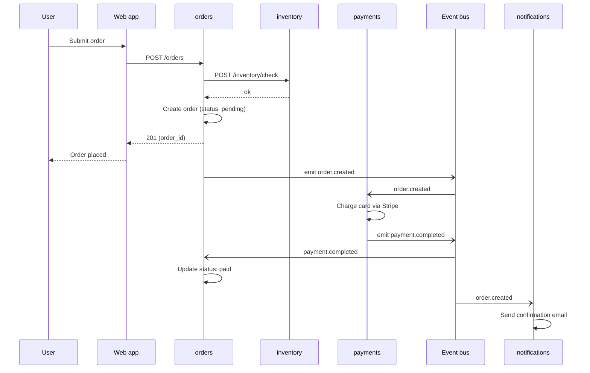

# Templates

These are the exact templates for each output section. They embed the Diátaxis mode and the writing principles into reusable structures. Follow them.

## Overview template

The overview is the single most important page. The reader who lands on the docs and reads only this page should walk away with a complete (if shallow) mental model of the system.

**Target length**: 400–800 words. Going over 1000 means the overview is doing the work of other pages — cut it.

**Mode**: Explanation primary, with a small Tutorial-flavored "where to go next" section at the end.

```markdown
# [System name]

[Opening sentence — what the system does for whom, in plain language. NOT "this is a
microservices architecture for...". Instead: "[System name] processes orders for an online
retailer. It accepts orders from the web and mobile apps, validates inventory, charges
payment, and notifies the user." If the audience includes external API consumers, name them
in this sentence too.]

[Second sentence — the most important constraint or context. "Built for [scale/audience]"
or "Originally a monolith, now [N] services" or "Designed to support [specific business
requirement]". This is what makes the system *this* system rather than a generic one.]

## What you'll find here

[Two or three sentences orienting the reader to the docs. What is documented, what is not,
how the docs are organized. Example:]

This site documents the [N] services that make up [system name], how they communicate, and
how to work on them. For external API integration, see [link]. For internal contributors,
start with the [Onboarding guide].

## The system at a glance

[One paragraph + one diagram. The diagram is the C4 Context or Container view — the
high-level shape. The paragraph explains the *axes* by which the system is divided. For
example: "The system is split along business-capability lines, not technical lines. The
`orders`, `payments`, `inventory`, and `notifications` services each own one capability
end-to-end — their own database, their own API, their own deploy."]

[Mermaid diagram — see references/diagrams.md for how to construct it]

[Optional second paragraph: name the most important integration pattern, in one or two
sentences. "Services communicate primarily over HTTP for synchronous needs and a shared
event bus (Redis Streams) for asynchronous notifications."]

## The services

[A list of services, but NOT a wall of bullets. Each entry is service-name + one
sentence + one link. The sentence answers "what does it do for the system?" not "what
does it do internally?".]

- **`orders`** — Accepts new orders, validates them, and emits the events that drive
  everything downstream. [→ details](services/orders.md)
- **`payments`** — Charges the user's card via Stripe and records the transaction.
  [→ details](services/payments.md)
- [...]

## How the pieces fit together

[1–2 paragraphs that walk through one canonical flow, narratively. Pick the flow that
exercises the most services — usually the "happy path" of the system's main job. This is
the most important paragraph in the overview, because it is what the reader will remember.]

When a user places an order, the web app calls `POST /orders` on the `orders` service. The
service validates inventory by calling `inventory.check`, then creates an order record in
its database and emits `order.created` to the event bus. The `payments` service, listening
for `order.created`, charges the user's saved card via Stripe and emits `payment.completed`
(or `payment.failed`). The `orders` service updates the order's status based on which
event arrives, and `notifications` sends the user an email accordingly.

[See [Integrations](integrations.md) for the full flow catalog.]

## Where to go next

Pick the entry point that matches what you want to do:

- **"I'm joining the team and I want to make a change today"** → [Onboarding](onboarding.md)
- **"I'm integrating with the API from outside"** → [API reference](api.md) (only if external audience applies)
- **"I want to understand why we built it this way"** → [Architecture decisions](decisions.md)
- **"I need to look up a specific endpoint or env var"** → [Reference](reference.md)
```

## Per-service page template

Each service page is mode-aware: a brief Explanation header, then Reference, then How-to.

**Target length**: 500–1500 words depending on service complexity. A trivial CRUD service is short. A complex orchestrator is longer.

```markdown
# `[service-name]`

[One sentence: what this service does, in plain language, from the perspective of the rest
of the system. "Issues and validates authentication tokens for all internal services."
NOT "this is a Python service that uses JWT".]

## Why it exists

[2–4 sentences of Explanation. What problem this service solves. What would happen if it
did not exist. Why it is a separate service rather than a module inside another one.
Acknowledge tradeoffs if relevant. This section is what makes the page *useful* rather
than just *informative*.]

Example: "Originally, each service handled its own authentication, which led to three
different token formats and a security incident in 2023 when one service forgot to validate
expiration. `auth` was extracted to centralize token issuance and validation. The
tradeoff is that `auth` is now a hard dependency for the whole system — when it is down,
new requests cannot be served. We accept this in exchange for consistency."

## Responsibilities

[A short list — 3 to 7 items max. Each item is a sentence-long verb phrase: what the
service does, not how. NOT "exposes a /login endpoint" — that's Reference. Instead:
"Issues access tokens to users who present valid credentials."]

- Issues access tokens to users who present valid credentials.
- Validates access tokens presented by other services.
- Revokes tokens when a user logs out or changes their password.
- Rotates signing keys every 30 days.

## What it does *not* do

[This section is optional but powerful. The reader's biggest source of confusion is the
boundary between services. Explicitly stating what this service does *not* do prevents a
class of bugs and questions.]

- Does not store user profiles — that is `users`.
- Does not enforce permissions — services check permissions themselves using token claims.

## Endpoints

[Reference mode. Use the endpoint template from references/writing-principles.md, or if
the service has many endpoints, group them and use a summary table at the top.]

[If the service has no public endpoints — for example, a worker — say so explicitly:]

This service exposes no HTTP endpoints. It runs as a background worker consuming from the
`order.created` topic.

## Environment variables

[Reference mode. Table.]

| Variable           | Required | Default       | Description                                      |
|--------------------|----------|---------------|--------------------------------------------------|
| `JWT_SECRET`       | yes      | —             | HMAC secret for token signing. Rotated every 30d. |
| `TOKEN_TTL_MINUTES`| no       | 15            | Access token lifetime.                            |
| `DB_URL`           | yes      | —             | Postgres connection string.                       |

## Dependencies

[Reference mode. What this service calls or depends on. Two views.]

**Calls (synchronous)**:
- `users` (HTTP) — to fetch user credentials during login.

**Consumes (event bus)**:
- `user.password_changed` — to invalidate existing tokens.

**Produces (event bus)**:
- `auth.token_revoked` — when a token is revoked.

## Common tasks

[How-to mode. Pick the 3–5 most common tasks a developer will do on this service. Each is
a complete how-to in 5–15 lines.]

### How to add a new claim to access tokens

1. Add the field to `TokenClaims` in `src/models.py`.
2. Set the claim in `issue_token()` in `src/handlers/login.py`.
3. If other services need to read the new claim, update the shared token-parsing library in
   `libs/auth-client`.
4. Run `pytest tests/test_token_issue.py` to confirm.

You will know it worked when a freshly-issued token decodes with your new claim present.

### How to rotate the signing key locally

[...]

## Diagram

[If the service has internal complexity worth diagramming — e.g., a state machine, a
non-trivial sequence — include a diagram with a caption. If it doesn't, skip this section.]
```

## Integrations page template

This is the page where the multi-repo nature shines. Do not list calls — narrate flows.

```markdown
# How services communicate

[One opening paragraph: the integration style of the system. Are services tightly coupled
or loosely? Synchronous or asynchronous? Hub-and-spoke or mesh? Name the patterns once,
upfront, so the reader has the vocabulary for the rest of the page.]

The system mixes synchronous HTTP (for request/response patterns the user is waiting on)
with asynchronous events on a Redis-backed bus (for fan-out patterns and side effects that
can happen later). As a rule, anything the user waits for is synchronous; anything the user
does not wait for is an event.

## The call graph

[A high-level diagram showing which services call which. Use a flowchart, not a sequence
diagram — sequence is for flows, not for the structural view.]

```mermaid
graph LR
  web[Web app] --> orders
  web --> auth
  orders --> inventory
  orders --> payments
  payments --> stripe[Stripe API]
  orders -. emits .-> bus[(Event bus)]
  bus -. order.created .-> notifications
  bus -. order.created .-> analytics
```

Notice that no service calls `orders` — `orders` is a producer, not a consumer. This is
intentional: it lets `orders` evolve its internal model without breaking other services.
Downstream services see a stable event contract, not the service's internal API.

## Flow: a user places an order

[Sequence diagram + narrative. This is the page's most important section. Pick 3–5
canonical flows and document each one. Cover at least: the main happy path, the most
important failure path, and any non-obvious flow.]



What to notice:

- The user gets a response from the web app as soon as the order record is created. The
  payment happens in the background. This is why the order status is `pending` initially
  and may briefly stay `pending` before becoming `paid`.
- Notifications and payments react to the same event independently. Neither knows about
  the other. If notifications is down, payments still happens — and vice versa.
- If the payment fails, the user is notified by email but the order record stays in the
  system with status `payment_failed`. It is not deleted, for audit reasons.

## Flow: a user's payment fails
[...]

## What happens when a service is down

[Brief Explanation section: failure modes. The reader will eventually face an outage; tell
them what to expect now so they can debug faster later.]

- **`auth` down**: no new requests accepted. Existing sessions continue working until their
  tokens expire.
- **`orders` down**: no new orders can be placed. Existing orders continue to be processed
  (payments completes in the background based on events already emitted).
- **`payments` down**: orders accumulate in `pending` state. When `payments` recovers, it
  catches up on the event backlog.
```

## Onboarding template

This is pure Tutorial mode, for the internal-audience case.

```markdown
# Your first hour with [system name]

By the end of this hour you will have the full system running on your laptop, made one
successful API request, and committed a small change to a branch. After that, you'll know
where the rest of the docs fit in.

## Before you start

You need:

- [Tool A, version X.Y+]
- [Tool B, version X.Y+]
- Access to [internal resource — credentials, vault, etc.]
- About one hour of focused time. The first run downloads images and can be slow.

## Step 1: Clone the repos and start the stack

```bash
git clone [primary repo URL]
cd [repo]
./scripts/bootstrap.sh
docker-compose up
```

After about 2–5 minutes you should see "All services healthy" in the logs, and
`docker-compose ps` should show every service with status `Up`.

If a service fails to start, see [troubleshooting](troubleshooting.md). The most common
issue is [the most common issue].

## Step 2: Make your first request

In a new terminal:

```bash
curl -X POST http://localhost:8080/orders \
  -H "Authorization: Bearer dev-token" \
  -d '{"sku": "ABC", "qty": 1}'
```

You should see a response like:

```json
{"order_id": "ord_abc123", "status": "pending"}
```

A second later, check `docker-compose logs notifications` — you should see a "would have
sent email" log line. (In dev mode, emails are logged but not sent.)

You have just exercised three services: `orders` created the record, `payments` (mocked in
dev) charged the card, and `notifications` reacted to the event.

## Step 3: Make a small change

Let's add a new field to the order response.

1. Open `services/orders/src/handlers/create.py`.
2. Find `return {"order_id": ..., "status": ...}`.
3. Add `"timestamp": now_iso()` to the return dict.
4. Save. The service hot-reloads.
5. Re-run the curl command from step 2. You should now see a `timestamp` field.

Roll the change back when you're done:

```bash
git checkout services/orders/src/handlers/create.py
```

## What you just learned

- The repo layout (you saw `services/orders/src/...`).
- How services hot-reload (most do, some don't — see [development guide](dev.md)).
- That a single HTTP request can trigger multiple services through events.
- Where to look in logs to confirm something happened.

## Where to go next

- "I want to add a real endpoint" → [How to add an endpoint](how-to/add-endpoint.md)
- "I want to understand the architecture" → [Overview](overview.md)
- "I'm stuck and something doesn't work" → [Troubleshooting](troubleshooting.md)
```
